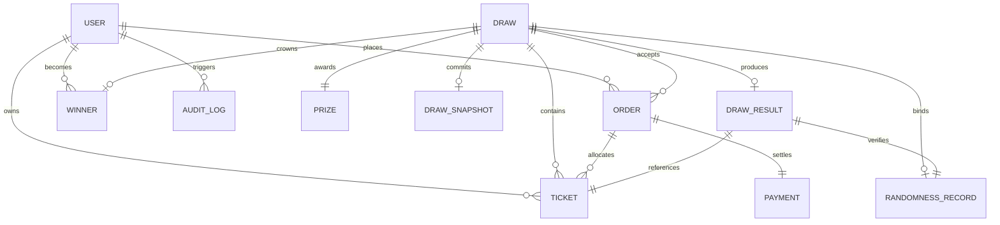

# NATI LOTTO - System Architecture & Engineering Blueprint
**"Your Chance. Your Moment."**
*Document Version: 1.0.0 | Engineering Architecture Standard*

---

## 1. Architectural Overview

NATI LOTTO is architected as an **enterprise-grade, high-concurrency prize-draw platform** specifically optimized for the Ethiopian national market while maintaining international fintech security and compliance standards.

```
+-----------------------------------------------------------------------------------+
|                                  CLIENT LAYER                                     |
|  +-------------------------------------+   +------------------------------------+  |
|  |     Flutter Mobile Application      |   |        Vite + React Web App        |  |
|  |   (iOS / Android / Amharic & EN)    |   |     (Public Portal & Operator UI)  |  |
|  +-------------------------------------+   +------------------------------------+  |
+-----------------------------------------------------------------------------------+
                                         |
                                HTTPS / WSS (TLS 1.3)
                                         v
+-----------------------------------------------------------------------------------+
|                                  API GATEWAY                                      |
|    Helmet Security | CORS | Throttler Rate Limiting | JWT Passport Auth | RBAC    |
+-----------------------------------------------------------------------------------+
                                         |
                                         v
+-----------------------------------------------------------------------------------+
|                           MODULAR BACKEND ENGINE                                  |
|  +-------------------+  +--------------------+  +-------------------------------+ |
|  |   Orders Engine   |  | Cryptographic Draw |  |      Payments Abstraction     | |
|  | (Pessimistic Lock |  |       Engine       |  |  +-------------------------+  | |
|  |   Anti-Oversell)  |  | (CSPRNG Commit-    |  |  | Telebirr (RSA-SHA256)   |  | |
|  +-------------------+  |      Reveal)       |  |  +-------------------------+  | |
|                         +--------------------+  |  | CBE Birr (Direct Pay)   |  | |
|  +-------------------+  +--------------------+  |  +-------------------------+  | |
|  | Compliance Guard  |  | Live Draw Gateway  |  |  | Mock Dev Provider       |  | |
|  | (18+ & Limits)    |  | (WebSocket PubSub) |  +-------------------------------+ |
|  +-------------------+  +--------------------+                                    |
|                         +--------------------+                                    |
|                         | Append-Only Audit  |                                    |
|                         +--------------------+                                    |
+-----------------------------------------------------------------------------------+
                                         |
                    +--------------------+--------------------+
                    v                                         v
+---------------------------------------+ +-----------------------------------------+
|        PRIMARY DATA STORE             | |           CACHE & REAL-TIME             |
|       PostgreSQL (ACID)               | |              Redis Pub/Sub              |
|  - Concurrency Row Locking (FOR UPDATE) | |  - Live Draw Event Streaming          |
|  - Sequential Ticket Allocation       | |  - Distributed Rate Limiting Throttling |
|  - Cryptographic Hash Commitments     | |  - Active Draw State Caching            |
|  - Immutable Audit Log                | |                                         |
+---------------------------------------+ +-----------------------------------------+
```

---

## 2. Monorepo Organization

The codebase is organized in an enterprise monorepo structure:

```
nati-lotto/
├── apps/
│   ├── api/                 # NestJS 10 Enterprise API Server
│   │   ├── prisma/          # Prisma schema & seed data
│   │   ├── src/             # Modular controllers, services, guards
│   │   └── test/            # Concurrency and cryptographic test suite
│   ├── mobile/              # Flutter 3.35 Production Mobile Application
│   │   ├── lib/             # Presentation, domain models, repositories, i18n
│   │   └── test/            # Flutter widget & unit test suite
│   └── web/                 # Vite + React 18 Web & Admin Dashboard Portal
│       └── src/             # Responsive design system & auditable views
├── packages/
│   ├── shared-types/        # DTOs, Enums, Audit, and WebSocket event types
│   ├── config/              # Brand tokens, compliance limits, and feature flags
│   └── validation/          # Zod validation schemas for all inputs
├── docs/                    # Architecture, security, draw-integrity, and API docs
└── infra/                   # Docker Compose, PostgreSQL, Redis, and MinIO configs
```

---

## 3. Database Schema & Domain Model

The relational schema guarantees referential integrity, cascading protections, and append-only constraints:



### Core Entities:
1. **`User`**: Account identity, phone number (+251), KYC verification status, daily ticket purchase tracking, and self-exclusion cooldown timestamps.
2. **`Draw`**: Prize-draw definition, total ticket capacity, sold ticket count, ticket price in ETB, National Lottery permit registration, draw phase (`DRAFT`, `OPEN`, `CLOSED`, `AUTHORIZED`, `DRAWING`, `COMPLETED`), and SHA-256 snapshot hash.
3. **`Ticket`**: Immutable ticket entry with strict sequence number (`1..N`), display ticket number (`#0001`), draw ID, user ID, status (`PENDING`, `CONFIRMED`, `WON`, `LOST`), and tamper-proof verification hash.
4. **`Order`**: Multi-ticket purchase order with subtotal, discount, and status.
5. **`Payment`**: Financial transaction record with provider (`TELEBIRR`, `CBE_BIRR`, `MOCK`), transaction ID, raw payload, and idempotent processing state.
6. **`DrawSnapshot`**: Pre-draw cryptographic snapshot capturing all confirmed tickets, timestamp, and SHA-256 hash before randomness acquisition.
7. **`RandomnessRecord`**: 256-bit CSPRNG entropy record storing seed hash, seed hex, provider, and entropy timestamp.
8. **`DrawResult`**: Final committed draw result binding snapshot hash, seed hex, winning ticket, and result hash.
9. **`AuditLog`**: Append-only audit trail recording every state transition, actor ID, and IP address.

---

## 4. Concurrency & Overselling Prevention

To guarantee that no draw ever sells more tickets than its authorized capacity, NATI LOTTO uses **PostgreSQL pessimistic row locking**:

```typescript
// Atomic ticket reservation transaction
await prisma.$transaction(async (tx) => {
  // 1. Lock the draw row for update
  const draw = await tx.$queryRaw`
    SELECT id, "totalTickets", "soldTickets", status 
    FROM "Draw" 
    WHERE id = ${drawId} 
    FOR UPDATE
  `;

  // 2. Validate remaining capacity
  if (draw.soldTickets + requestedQuantity > draw.totalTickets) {
    throw new BadRequestException('Insufficient tickets remaining in draw.');
  }

  // 3. Atomically advance sequential counter
  const startSequence = draw.soldTickets + 1;
  const newSold = draw.soldTickets + requestedQuantity;

  await tx.draw.update({
    where: { id: drawId },
    data: { soldTickets: newSold },
  });

  // 4. Batch create sequential tickets
  // ...
});
```

This guarantees:
- Zero race conditions even under 10,000 concurrent purchase attempts.
- Contiguous sequence numbers with zero gaps and zero duplicates.
- Strict inventory integrity matching National Lottery permit authorizations.

---

## 5. Ethiopian Payment Integration

### Telebirr (Ethio Telecom)
- **Signature Algorithm**: RSA with SHA-256 (`RSA-SHA256`).
- **Flow**:
  1. User selects quantity in Flutter mobile app or web portal.
  2. API creates order and signs request payload using platform private key.
  3. User completes biometric or USSD confirmation in Telebirr app.
  4. Telebirr delivers signed callback to `/api/v1/payments/webhook/telebirr`.
  5. Webhook verifies RSA signature against Ethio Telecom public key.
  6. Idempotent payment handler confirms tickets and emits WebSocket updates.

### CBE Birr (Commercial Bank of Ethiopia)
- Direct merchant settlement via merchant account integration.
- Instant callback with transaction reference validation.

---

## 6. Real-Time Live Draw Arena (WebSocket Protocol)

The live draw experience connects users to a real-time event pipeline powered by Redis Pub/Sub and Socket.IO:

| Event Name | Direction | Payload |
| :--- | :--- | :--- |
| `draw:subscribe` | Client -> Server | `{ drawId: string }` |
| `draw:countdown` | Server -> Client | `{ drawId, secondsRemaining: 10 }` |
| `draw:barrel_roll` | Server -> Client | `{ drawId, durationMs: 4000 }` |
| `draw:winner_revealed` | Server -> Client | `{ drawId, winningTicketNumber, winnerDisplayName, resultHash }` |

The barrel-rolling animation on client devices is **purely a visualizer** for the authoritative, cryptographically committed result calculated by `DrawEngineService`. No client code has authority over the winning outcome.
