# NATI LOTTO - Cryptographic Draw Integrity & Verification Architecture
**"Your Chance. Your Moment."**
*Document Version: 1.0.0 | Security Classification: Public / Auditable*

---

## 1. Executive Summary

Lottery systems and prize-draw platforms frequently suffer from public skepticism regarding winner legitimacy, internal operator collusion, and "black box" drawings. 

**NATI LOTTO** is engineered from the ground up to eliminate trust assumptions. Every draw executed on NATI LOTTO is **cryptographically bound, publicly verifiable, and mathematically auditable**. No internal database administrator, platform developer, or regulatory official can tamper with ticket inclusion or retroactively alter the winning ticket without invalidating the immutable cryptographic proof.

---

## 2. Core Cryptographic Invariants

| Principle | Technical Implementation | Guarantee |
| :--- | :--- | :--- |
| **No Math.random()** | Prohibited via ESLint AST rules and compile-time checks | Eliminates predictable V8 pseudo-random sequences (XorShift128+) |
| **CSPRNG Entropy** | Node.js `crypto.randomBytes(32)` (256 bits) | Direct access to OS-level kernel CSPRNG (`/dev/urandom` / `BCryptGenRandom`) |
| **Pre-Draw Snapshot** | SHA-256 hash of all confirmed, ordered tickets | Mathematically freezes the participant set before randomness acquisition |
| **Zero Modulo Bias** | 256-bit integer mapped over $N$ ($N \le 100,000$) | Residual bias is bounded below $2^{-239} < 10^{-72}$ (imperceptible) |
| **Immutable Commitment** | Combined Result Hash signed and permanently committed | Result links snapshot, seed, winning ticket number, and ticket ID |
| **Public Verifiability** | `/verify` web & mobile page + offline verification scripts | Any third party can independently reproduce the winner selection |

---

## 3. The 10-Step Commit-Reveal Draw Protocol

```mermaid
sequenceDiagram
    autonumber
    participant Users as Participants
    participant OrderEngine as Orders & Tickets Service
    participant DrawEngine as Cryptographic Draw Engine
    participant DB as PostgreSQL (Append-Only)
    participant RedisPubSub as Redis Event Stream
    participant Audit as Immutable Audit Log
    participant Public as Public Hash Verifier (/verify)

    Users->>OrderEngine: Purchase Tickets (Telebirr / CBE Birr)
    Note over OrderEngine,DB: Strict Concurrency Locking (SELECT FOR UPDATE)
    OrderEngine->>DB: Allocate Sequential Tickets (#0001, #0002...)
    
    rect rgb(30, 41, 59)
    Note over DrawEngine: PHASE 1: FREEZE & SNAPSHOT COMMITMENT
    DrawEngine->>OrderEngine: Freeze Ticket Sales (Status: CLOSED)
    DrawEngine->>DB: Query confirmed tickets ordered deterministically by sequenceNumber
    DrawEngine->>DrawEngine: Compute Pre-Draw SHA-256 Snapshot Hash
    DrawEngine->>DB: Commit DrawSnapshot record & bind snapshotHash to Draw
    DrawEngine->>Audit: Log DRAW_SNAPSHOT_CREATED
    end

    rect rgb(20, 83, 45)
    Note over DrawEngine: PHASE 2: REGULATORY AUDIT & AUTHORIZATION
    DrawEngine->>DrawEngine: Verify snapshot integrity against National Lottery permit
    DrawEngine->>DB: Transition Draw to AUTHORIZED
    DrawEngine->>Audit: Log DRAW_AUTHORIZED
    end

    rect rgb(120, 53, 15)
    Note over DrawEngine: PHASE 3: ENTROPY ACQUISITION & CALCULATION
    DrawEngine->>DrawEngine: crypto.randomBytes(32) -> seedHex (256 bits)
    DrawEngine->>DrawEngine: seedHash = sha256(seedHex)
    DrawEngine->>DrawEngine: winningIndex = BigInt("0x" + seedHex) % BigInt(totalTickets)
    DrawEngine->>DrawEngine: winningTicket = eligibleTickets[winningIndex]
    DrawEngine->>DrawEngine: resultHash = sha256(snapshotHash + ":" + seedHex + ":" + ticketNum + ":" + ticketId)
    end

    rect rgb(88, 28, 135)
    Note over DrawEngine,Public: PHASE 4: ATOMIC COMMITMENT & LIVE STREAMING
    DrawEngine->>DB: BEGIN TRANSACTION (Result, Randomness, Winner, Tickets updated, Draw COMPLETED)
    DB-->>DrawEngine: COMMIT SUCCESS
    DrawEngine->>RedisPubSub: Publish "draw.completed" event
    RedisPubSub->>Users: Live Arena animation rolls and reveals winning ticket
    DrawEngine->>Audit: Log DRAW_COMPLETED
    Public->>DrawEngine: Fetch snapshotHash, seedHex, ticket count
    Public->>Public: Independently recompute winner and verify resultHash matches 100%
    end
```



---

## 4. Mathematical Uniformity & Modulo Bias Elimination

Let $N$ be the total number of confirmed tickets in a given draw, where $1 \le N \le 100,000$.

### Why `Math.random()` Fails
Standard JavaScript `Math.random()` utilizes the **xorshift128+** PRNG algorithm:
1. It maintains only 128 bits of state.
2. It returns a double-precision floating-point number with only 53 bits of precision ($2^{53}$ states).
3. The internal state can be fully reconstructed by an adversary observing consecutive outputs, allowing them to predict future draw outcomes.

### NATI LOTTO 256-Bit Integer Mapping
NATI LOTTO generates 32 bytes (256 bits) of cryptographic entropy directly from the operating system's cryptographic random source:

$$S \in [0, 2^{256} - 1]$$

The winning ticket index $W$ is mapped onto the set $\{0, 1, \dots, N-1\}$ via:

$$W = S \pmod N$$

### Quantification of Modulo Bias
When a large range $[0, 2^B - 1]$ is mapped onto $[0, N-1]$ via modulo arithmetic, some residues may occur $\lfloor 2^B / N \rfloor + 1$ times, while others occur $\lfloor 2^B / N \rfloor$ times.

The maximum probability discrepancy $\Delta P$ between any two tickets is:

$$\Delta P = \frac{1}{2^{256}} < 10^{-77}$$

For a draw with $N = 10,000$ tickets:
- The ideal probability for each ticket is $P_{\text{ideal}} = \frac{1}{10,000} = 10^{-4}$.
- The maximum deviation is bounded by:

$$\left| P(\text{Ticket}_k) - P_{\text{ideal}} \right| \le \frac{1}{2^{256}} \approx 8.6 \times 10^{-78}$$

This deviation is trillions of orders of magnitude below observable physics limits (such as single-bit memory cosmic ray flips), rendering modulo bias mathematically non-existent.

---

## 5. Independent Verification Algorithm

Anyone can verify any historical or active draw using this standalone algorithm in any programming environment (Node.js, Python, Rust, Go, or in-browser JavaScript):

```typescript
import * as crypto from 'crypto';

interface AuditVerificationInput {
  snapshotHash: string;
  seedHex: string;
  eligibleTickets: Array<{
    sequenceNumber: number;
    ticketNumber: string;
    id: string;
    userId: string;
  }>;
  expectedResultHash: string;
  expectedWinningTicketNumber: string;
}

export function verifyDrawIntegrity(input: AuditVerificationInput): boolean {
  // Step 1: Reconstruct snapshot payload and verify snapshot hash
  const reconstructedPayload = input.eligibleTickets
    .map((t) => `${t.sequenceNumber}:${t.ticketNumber}:${t.id}:${t.userId}`)
    .join('|');

  const computedSnapshotHash = crypto
    .createHash('sha256')
    .update(reconstructedPayload)
    .digest('hex');

  if (computedSnapshotHash !== input.snapshotHash) {
    throw new Error('Snapshot hash mismatch: ticket payload has been altered.');
  }

  // Step 2: Calculate winning index from seedHex and ticket count
  const eligibleCount = BigInt(input.eligibleTickets.length);
  const seedBigInt = BigInt('0x' + input.seedHex);
  const winningIndex = Number(seedBigInt % eligibleCount);
  const calculatedWinner = input.eligibleTickets[winningIndex];

  if (calculatedWinner.ticketNumber !== input.expectedWinningTicketNumber) {
    throw new Error(`Winner mismatch: expected ${input.expectedWinningTicketNumber}, calculated ${calculatedWinner.ticketNumber}`);
  }

  // Step 3: Verify result hash commitment
  const computedResultHash = crypto
    .createHash('sha256')
    .update(`${input.snapshotHash}:${input.seedHex}:${calculatedWinner.ticketNumber}:${calculatedWinner.id}`)
    .digest('hex');

  if (computedResultHash !== input.expectedResultHash) {
    throw new Error('Result hash mismatch: proof commitment is invalid.');
  }

  return true; // 100% Cryptographically Verified
}
```

---

## 6. Audit Trail & Regulatory Compliance

Every draw lifecycle event creates an immutable, append-only record in the `AuditLog` database table containing:
1. `timestamp`: ISO-8601 millisecond timestamp.
2. `actorId`: System engine ID or authorized administrator ID.
3. `actorRole`: `SYSTEM_CSPRNG`, `COMPLIANCE_OFFICER`, or `SUPER_ADMIN`.
4. `action`: `DRAW_SNAPSHOT_CREATED`, `DRAW_AUTHORIZED`, `DRAW_COMPLETED`, or `PRIZE_CLAIMED`.
5. `metadata`: Cryptographic hashes, ticket counts, and regulatory permit numbers.

The audit log is append-only with row-level integrity checks, ensuring that no state transition can be deleted or overwritten.
